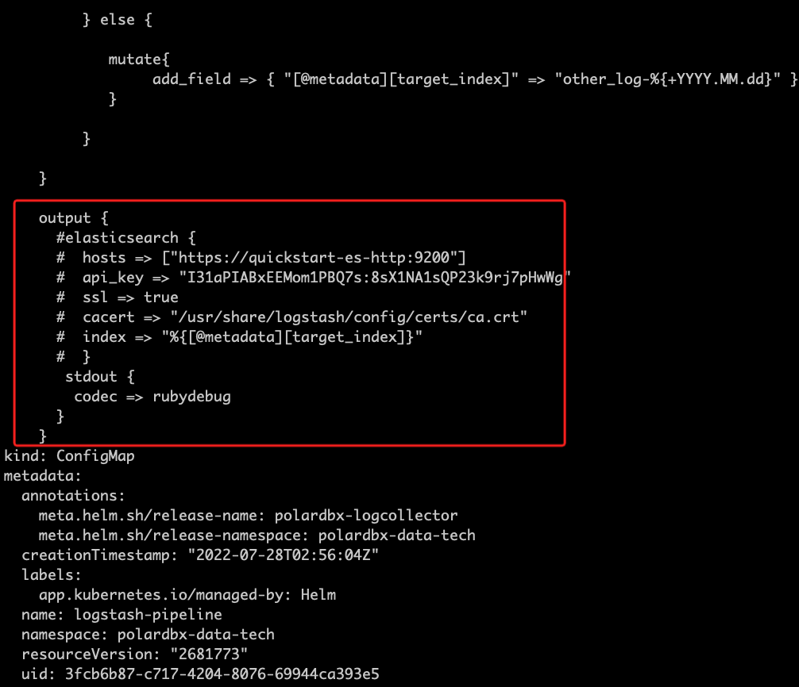
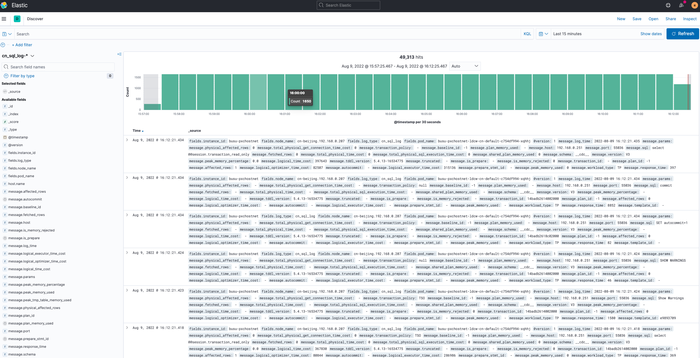
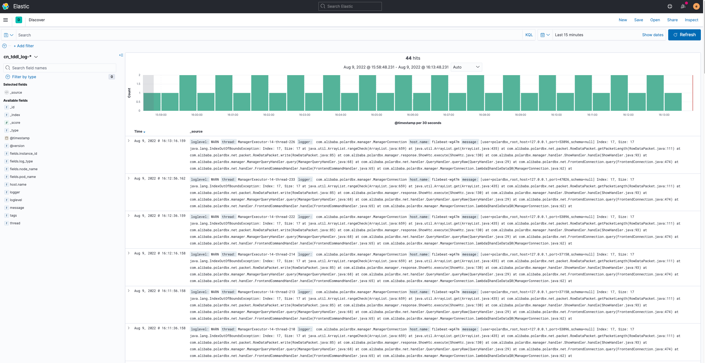
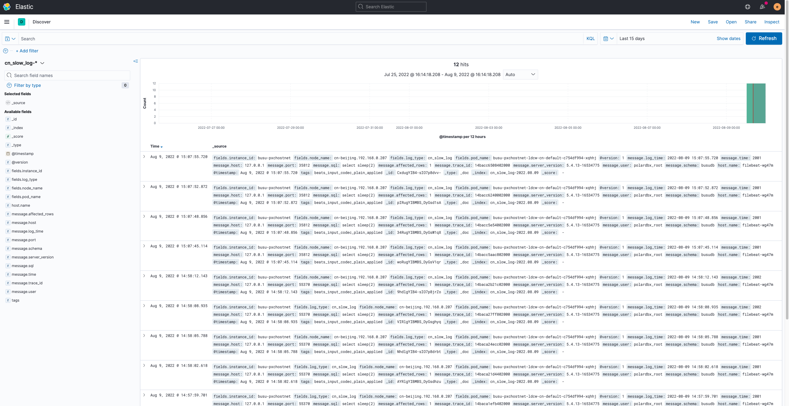

# 日志采集

本文介绍如何在 k8s 集群中为 PolarDB-X 数据库开启日志采集功能。

## 采集内容
### 计算节点的日志
| 日志 | Pod内路径 | 是否进行了解析 |
| --- | --- | --- |
| SQL日志 | /home/admin/drds-server/logs/*/sql.log | 是 |
| 慢日志 | /home/admin/drds-server/logs/*/slow.log | 是 |
| 错误日志 | /home/admin/drds-server/logs/*/tddl.log | 否 |
>容器内路径中的*表示任意目录名

## 安装 PolarDB-X LogCollector
PolarDB-X通过Filebeat采集日志，将原始日志发送到Logstash进行解析并发送给最后的存储端。
### 前置要求
1. 已经准备了一个运行中的 K8s 集群，并确保集群版本 >= 1.18.0
2. 已经安装了 [Helm 3](https://helm.sh/docs/intro/install/)
3. 已经安装 PolarDB-X Operator 1.2.2 及以上的版本

### Helm包安装
首先创建一个名为 polardbx-logcollector 的命名空间:
```
kubectl create namespace polardbx-logcollector
```

执行如下命令安装 PolarDB-X LogCollector：
```
 helm install --namespace polardbx-logcollector polardbx-logcollector https://github.com/polardb/polardbx-operator/releases/download/v1.3.0/polardbx-logcollector-1.3.0.tgz
```

您也可以通过 PolarDB-X 的 Helm Chart 仓库安装:
```bash
helm repo add polardbx https://polardbx-charts.oss-cn-beijing.aliyuncs.com
helm install --namespace polardbx-logcollector polardbx-logcollector polardbx/polardbx-logcollector
```
> 注：默认安装配置下，Filebeat通过DaemonSet的形式安装到k8s集群的机器上，默认每个Filebeat Pod会占用占用 500MB 内存和 1 个CPU核；Logstash Pod默认部署一个，每个占用 1.5GB 内存和 2 个CPU核。具体默认可查看: [values.yaml](https://github.com/polardb/polardbx-operator/blob/main/charts/polardbx-logcollector/values.yaml)。

期望看到如下输出：
```
polardbx-operator logcollector plugin is installed. Please check the status of components:

    kubectl get pods --namespace {{ .Release.Namespace }}

Now start to collect logs of  your polardbx cluster.
```

## 查看日志

### 开启日志采集
PolarDB-X 集群的日志采集功能默认关闭，您可以通过如下命令控制控制日志采集的开启与关闭：

打开 PolarDB-X 实例的 CN 节点日志采集：
```
kubectl patch pxc {pxc name} --patch '{"spec":{"config":{"cn":{"enableAuditLog":true}}}}' --type merge
```
关闭 PolarDB-X 实例的 CN 节点日志采集：
```
kubectl patch pxc {pxc name} --patch '{"spec":{"config":{"cn":{"enableAuditLog":false}}}}' --type merge
```

### 在 Logstash 标准输出查看日志

PolarDB-X 使用Logstash作为日志的解析和上报组件, 默认将日志输出到标准控制台，方便使用者验证日志的采集和解析链路是否正常。通过下面的命令查看日志采集：
```shell
kubectl logs -f  {logstash pod name} -n polardbx-logcollector
```


## 将日志投递到其它系统

Logstash支持多种[输出插件](https://www.elastic.co/guide/en/logstash/current/output-plugins.html) , 您也可[开发自己的输出插件](https://www.elastic.co/guide/en/logstash/current/output-new-plugin.html) ， 根据实际需求将 PolarDB-X 日志投递到其它系统做进一步分析。

Logstash 的 output plugin 配置保存在 polardbx-logcollector 命名空间下名为 logstash-pipeline 的 ConfigMap 中，您可以通过如下命令修改 logstash 的 output 配置。
```shell
kubectl edit configmap logstash-pipeline -n polardbx-logcollector
```

logstash-pipeline 的 output 配置如下图所示：



下面本文将以 ElasticSearch 为例，介绍如何配置 Logstash，将 PolarDB-X 投递到 ElasticSearch 集群。

### 投递日志至 ElasticSearch

如果您的环境已经有 ES 集群，可以直接跳过《创建 ElasticSearch》。

#### 创建 ElasticSearch

参考如下文档在 K8s 集群中快速部署一个测试的 ES 集群。

1. [部署 ElasticSearch Operator](https://www.elastic.co/guide/en/cloud-on-k8s/current/k8s-deploy-eck.html#k8s-deploy-eck)
2. [部署 ElasticSearch Cluster](https://www.elastic.co/guide/en/cloud-on-k8s/current/k8s-deploy-elasticsearch.html), 该步骤中需要获取ES 集群的endpoint，用户名，密码，证书。
ES 集群的访问证书可以通过如下命令获取：
```shell
kubectl get secret quickstart-es-http-certs-public -o=jsonpath='{.data.ca\.crt}'
```
3. [部署 Kibana](https://www.elastic.co/guide/en/cloud-on-k8s/current/k8s-deploy-kibana.html)
> 注：上述 ES 集群仅用于测试，生产环境请自行配置 ES 集群。

#### 更新证书 Secret

如果 ES 集群采用 HTTP 访问，可以跳过该步骤。

如果 ES 集群采用HTTPS 访问，需要配置证书，证书文件(/usr/share/logstash/config/certs/ca.crt)已通过 polardbx-logcollector 命名空间的 elastic-certs-public secret 挂载到 Logstash 的 Pod 中，通过如下命令更新secret:
```shell
kubectl edit secret elastic-certs-public -n polardbx-logcollector
```

#### 配置 logstash output

前置条件：
- k8s集群内可访问的 ES 集群地址;
- 打开ES自动创建索引功能；
- ES集群的上创建一个API Key 或者 账号密码；
- 如果使用https，则需要ES集群证书。将内容写入ES证书Secret中，证书Secret为 polardbx-logcollector 命名空间的 elastic-certs-public，证书文件名为ca.crt。

通过如下命令更新 Logstash 的output 配置：

```shell
kubectl edit configmap logstash-pipeline -n polardbx-logcollector
```

例如，下面给出了一个 ES 集群配置的示例：
```
output {
  elasticsearch {
    hosts => ["https://quickstart-es-http.default:9200"]
    user => elastic
    password => sTF9B37N0jAF45Kn2Jwt874N
    ssl => true
    cacert => "/usr/share/logstash/config/certs/ca.crt"
    index => "%{[@metadata][target_index]}"
   }
}
```

- 如需了解更多的配置，可访问 [Elastic Search Output Plugins Options](https://www.elastic.co/guide/en/logstash/current/plugins-outputs-elasticsearch.html#plugins-outputs-elasticsearch-options)


启用elasticsearch输出插件后，记得**注释掉stdout的输出配置**。

#### 访问Kibana

参考[部署Kibana](https://www.elastic.co/guide/en/cloud-on-k8s/current/k8s-deploy-kibana.html#k8s-deploy-kibana), 登录Kibana 创建三个 Index Pattern, 用于查询日志:

| 日志类型 | Index Pattern |
| --- | --- | 
| SQL日志 | cn_sql_log-* |
| 慢日志 | cn_slow_log-* |
| 错误日志 | cn_tddl_log-* |

Kibana 创建 Index Pattern 如下图所示：

#### 日志效果图
SQL日志


错误日志


慢日志


### 其他
- [已有输出的插件](https://www.elastic.co/guide/en/logstash/current/output-plugins.html)
- [开发新的输出插件](https://www.elastic.co/guide/en/logstash/current/output-new-plugin.html)

# values.yaml介绍
用户可根据自己实际情况对 polardbx-logcollector 的安装配置进行定制，values.yaml路径：charts/polardbx-logcollector/values.yaml，文件对各个配置项进行了详细的注解。

# 日志字段介绍
查看[日志字段介绍](2-logfield.md)。

# 资源配置和性能调优建议
## 资源

| logstash单核    | filebeat单核     |
|---------------|----------------|
| 5000 events/s | 12000 events/s |
为了让核数得到充分利用，且不会oom的产生，我们需要合理配置内存资源、并发数、缓存大小等

## 建议根据具体场景调整的参数

### filebeat的filebeat.yml配置文件
ConfigMap名称为filebeat-config。
参数：
- SQL日志配置项里的harvester_buffer_size大小
- queue.mem配置

参考：[filebeat配置](https://www.elastic.co/guide/en/beats/filebeat/current/configuring-howto-filebeat.html)

### logstash的jvm.options配置文件
ConfigMap名称为logstash-config。参数：
- -Xms和-Xmx

### logstash的logstash.yml配置文件
ConfigMap名称为logstash-config。参数：
- pipeline.batch.size
- pipeline.workers

参考：[logstash配置](https://www.elastic.co/guide/en/logstash/current/config-setting-files.html)
